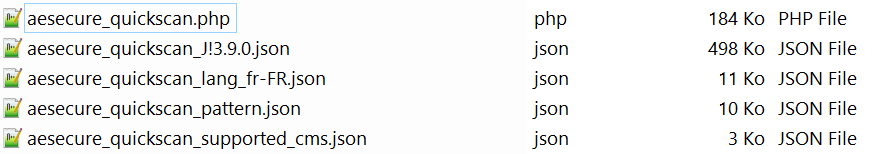
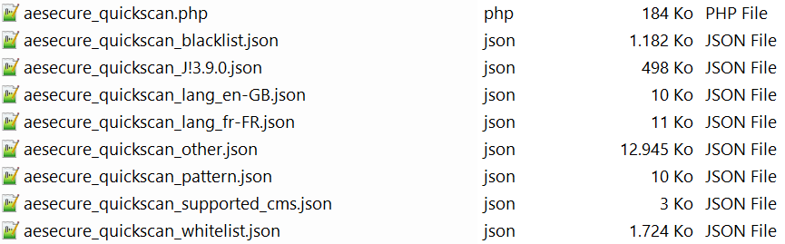
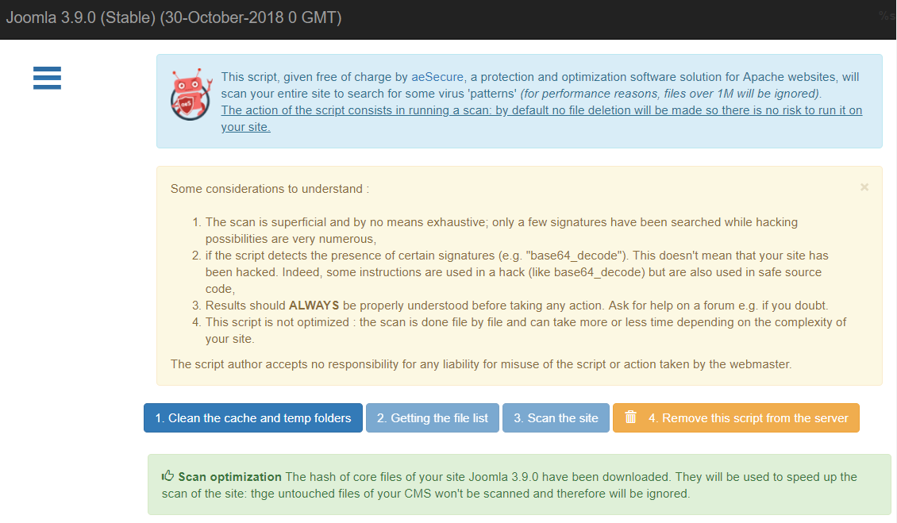
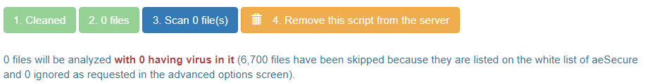
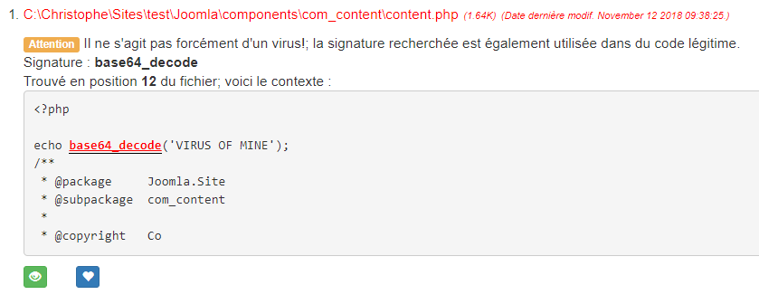
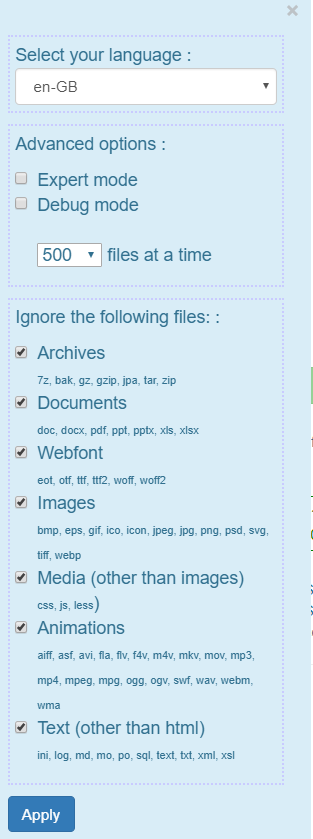

# aeSecure - QuickScan

<!-- cspell:ignore aesecure,quickscan,joomla,uncompress -->

  
French - Français

> Script PHP à installer sur votre site (de préférence en localhost pour de meilleures performances) pour analyser les fichiers à la recherche de virus.

**aeSecure QuickScan RECONNAÎT DÉJÀ PLUS DE 47 750 VIRUS (septembre 2023) et utilise des hachages de liste blanche pour éviter d'analyser les fichiers natifs de [WordPress](https://github.com/AFUJ/quickscan/tree/master/hashes/wordpress) et [Joomla](https://github.com/AFUJ/quickscan/tree/master/hashes/joomla).**

> ℹ️ **INSTALLATION**
> Vous avez juste besoin d'obtenir une copie de `aesecure_quickscan.php` et rien d'autre ; veuillez lire le [guide d'installation](#installation).

## Table des matières

- [Démo](#démo)
- [Installation](#installation)
- [Utilisation](#utilisation)
- [Licence](#licence)

## Démo

Vous pouvez jouer en ligne avec une démo ici : [https://quickscan.avonture.be/](https://quickscan.avonture.be/)

## Installation

aeSecure QuickScan téléchargera automatiquement les fichiers dont il a besoin, donc la seule chose que vous devez faire est d'obtenir une copie du fichier `aesecure_quickscan.php` et rien d'autre.

1. Cliquez sur le lien suivant pour ouvrir le fichier dans une nouvelle fenêtre : [obtenir une copie du script](https://raw.githubusercontent.com/AFUJ/quickscan/master/aesecure_quickscan.php)
2. Enregistrez le fichier à la racine de votre site web *(de préférence un site local pour des raisons de performance)*

Remarque : vous n'êtes pas obligé de nommer le fichier aesecure_quickscan, vous pouvez par exemple le nommer `scan.php`.

En principe, vous n'avez pas besoin de récupérer d'autres fichiers, seul le script `aesecure_quickscan.php` est suffisant.

### Ancienne version

Si vous avez besoin d'une version pour PHP 7.x, veuillez télécharger celle-ci : [https://raw.githubusercontent.com/cavo789/aesecure_quickscan/fa76e4c01fc8819c32953ad747e5e81aec228df0/aesecure_quickscan.php](https://raw.githubusercontent.com/cavo789/aesecure_quickscan/fa76e4c01fc8819c32953ad747e5e81aec228df0/aesecure_quickscan.php)

## Utilisation

### Démarrer QuickScan

Donc, dans le dossier racine de votre site web, vous avez le fichier `aesecure_quickscan.php` (ou `scan.php`). Pour l'exécuter, il suffit de démarrer un navigateur et d'accéder au fichier par URL par exemple `http://localhost/mon_site/aesecure_quickscan.php`.

Si vous utilisez Docker, vous pouvez également exécuter l'interface en lançant cette commande : `docker run -d -p 8080:80 -u $(id -u):$(id -g) -v "$PWD":/var/www/html php:8.2-apache` dans le dossier où se trouve votre site web et où vous avez copié le fichier `aesecure_quickscan.php`. Une fois cela fait, il suffit de démarrer l'interface en ouvrant votre navigateur et d'accéder à `http://localhost:8080/aesecure_quickscan.php`, attendez quelques secondes et la page du scanner s'affichera.

### Téléchargements automatiques

#### Lorsque l'interface est affichée

aeSecure QuickScan téléchargera automatiquement trois ou quatre fichiers :

- `aesecure_quickscan_lang_de-FR.json` (peut aussi être en-GB ou nl-BE) qui est le fichier pour votre langue. La langue préférée sera détectée à partir de la configuration de votre navigateur ;
- `aesecure_quickscan_pattern.json` contient des éléments de configuration pour le scanner ;
- `aesecure_quickscan_supported_cms.json` contient une liste de logiciels CMS reconnus par le scanner.

Si votre site web utilise un CMS supporté comme par exemple `Joomla` et une version supportée, un fichier nommé `aesecure_quickscan_XXXXXX.json` sera téléchargé (où `XXXXXX` est par exemple `J!3.9.0`).

Depuis la **version 2.1.0**, un répertoire hashes/\<CMS\>extensions a été ajouté. Dans le cas de Joomla!, le répertoire est J!extensions, pour Wordpress, il s'agit de WPextensions. Ces répertoires contiennent les fichiers de hashage des principales extensions Joomla!/Wordpress. Cela permet de **réduire le nombre de "faux positifs"**. Vous pouvez y ajouter vos propres extensions : voir la section **Créer les hashages**. 

Si quelque chose ne va pas avec le téléchargement automatique (pas de support `CURL` par exemple), vous serez invité à télécharger ces fichiers manuellement.

#### Lorsque 'Obtention de la liste des fichiers' est lancée

aeSecure QuickScan téléchargera automatiquement trois ou quatre fichiers supplémentaires :

- `aesecure_quickscan_blacklist.json` contient le hachage md5 des virus ;
- `aesecure_quickscan_edited.json` contient le hachage md5 des fichiers où des virus ont été ajoutés ;
- `aesecure_quickscan_other.json` contient le hachage md5 des fichiers considérés comme nettoyés (comme des composants bien connus de Joomla) ;
- `aesecure_quickscan_whitelist.json` contient le hachage md5 des fichiers considérés comme nettoyés (fichiers traités manuellement un par un par Christophe, auteur de QuickScan) ;

### Découvrir l'interface

Quelques points :

- Si le site web utilise un CMS supporté, son nom et son numéro de version seront affichés en haut de l'interface *(ce qui signifie également qu'un fichier .JSON a été téléchargé pour ce CMS et cette version)*,
- Vous avez un menu étendu sur le côté gauche de l'interface. Cliquez sur l'icône du menu hamburger pour l'afficher,
- Quelques déclarations de texte sont affichées (cliquez sur l'icône `x` pour les fermer) et,
- L'interface a principalement quatre boutons d'action :

1. Nettoyer les dossiers cache et temp

Pour améliorer la vitesse de l'analyse, les dossiers `/cache` et `/temp` seront d'abord vidés.
Vous devez cliquer sur ce bouton en premier.

2. Obtenir la liste des fichiers

Avant de commencer l'analyse, QuickScan doit savoir combien de fichiers il doit analyser. L'action `Obtention de la liste des fichiers` récupérera la liste de tous les fichiers de votre site et tous les fichiers de la liste blanche seront ignorés. Un fichier de la liste blanche est un fichier que QuickScan sait être propre. Comment ? Parce que le hachage md5 du fichier est mentionné dans un fichier de liste blanche comme le `aesecure_quickscan_J!5.2.5.json` (ou tout autre fichier de liste blanche).

En d'autres termes : `Obtention de la liste des fichiers` ne récupérera que les fichiers qui doivent être analysés. Dans une installation fraîche de Joomla ou WordPress, vous aurez très peu de fichiers à analyser puisque les fichiers natifs, de base, sont dans la liste blanche. Explication : J'ai généré des hachages pour de nombreuses versions (voir https://github.com/afuj/quickscan/tree/master/hashes/joomla et https://github.com/afuj/quickscan/tree/master/hashes/wordpress). Dès que QuickScan peut récupérer un fichier de hachage pour la version de Joomla/Wordpress que vous utilisez, un hachage sera calculé pour chaque fichier de votre site et si ce hachage est reconnu, cela signifie que votre fichier est sain, c'est-à-dire que son contenu est exactement celui présent dans une installation fraîche de Joomla/Wordpress et ne contient donc aucun virus. Dès qu'un fichier de base a été modifié, même avec un simple caractère d'espace, le hachage sera différent et donc non récupéré dans la liste. En conséquence, le fichier sera analysé même s'il fait partie des fichiers "de base" du CMS. Seuls les fichiers non modifiés seront considérés comme sains et non analysés.

Les fichiers **non modifiés** sont dans la liste blanche (s'ils n'ont pas été modifiés, bien sûr).

Comme vous pouvez le voir ci-dessous, dans une installation fraîche de Joomla 3.9.0, le nombre de fichiers à analyser est : zéro. Cela est dû au fait que rien n'a été ajouté au site et donc que 100% des fichiers sont dans notre liste blanche.

3. Analyser le site

Les fichiers restants seront analysés et si quelque chose est trouvé sur la base de

- nos modèles (stockés dans `aesecure_quickscan_pattern.json`),
- notre hachage de liste noire (`aesecure_quickscan_blacklist.json`) ou
- notre hachage modifié (`aesecure_quickscan_edited.json`)

Ensuite, le fichier sera affiché, et vous pourrez le mettre dans la liste blanche (si le fichier est propre (c'est-à-dire un faux positif)), ignorer le fichier (fermer simplement l'élément) ou supprimer le fichier.

Remarque : vous pouvez supprimer le fichier uniquement lorsque vous exécutez en mode expert de QuickScan.

4. Supprimer ce script du serveur

Une fois que vous avez analysé votre site ; n'oubliez pas de supprimer le script `aesecure_quickscan.php` et tous les fichiers JSON associés. Le bouton `Supprimer ce script` le fera pour vous.

### Mode expert

En cliquant sur l'icône du menu hamburger en haut à gauche de l'interface, vous afficherez un menu où, par exemple, vous pourrez activer le mode expert.

Dans ce mode, vous pourrez spécifier un chemin (comme faire une analyse d'un sous-dossier) et vous pourrez supprimer un fichier détecté. Un bouton `Supprimer ce fichier` sera affiché dans les résultats de l'analyse.

Vous aurez une autre option :

## Créer des hachages

Vous pouvez créer des hachages en obtenant une copie du fichier `make_hashes.php` de ce dépôt.

Pour Joomla!, téléchargez simplement la version souhaitée en naviguant sur [https://downloads.joomla.org/cms](https://downloads.joomla.org/cms) et obtenez l'archive souhaitée. Procédez exactement de la même manière pour WordPress.

Si vous avez besoin de plus d'une version, téléchargez simplement toutes les versions requises et enregistrez chaque archive dans le dossier `./hashes/joomla`.

Il est important que le nom de fichier de l'archive soit mis à jour et soit simplement la version. Par exemple, renommez `Joomla_5.0.0-Stable-Full_Package.zip` en `5.0.0.zip`.

Cela fait, je peux maintenant démarrer mon navigateur et le script `make_hashes.php`.

**Remarque** : à partir de la **version 2.1.0**, make_hashes.php décompresse le fichier d'installation, crée le fichier json associé et supprime le fichier zip ainsi que les répertoires créés pour générer le fichier json.

Si vous êtes un utilisateur de Docker, exécutez simplement `docker run -d -p 8080:80 -u $(id -u):$(id -g) -v "$PWD":/var/www/html php:8.2-apache` dans le dossier où vous avez cloné ce dépôt, puis démarrez votre navigateur et ouvrez `http://localhost:8080/make_hash.php`, attendez quelques secondes et c'est terminé.

Le script commencera immédiatement la création des hachages ; il n'y a rien à faire ; il suffit d'attendre.

Après quelques secondes, vous obtiendrez de nouveaux fichiers JSON (un par version) dans `./hashes/joomla`. 

Pour réduire le nombre de "faux positifs", vous pouvez aussi créer des fichiers de hashage pour les extensions que vous utilisez sur votre site. 

Pour Joomla, il suffit de copier le/les fichiers d'installation de votre extension au format zip (**à partir de sources fiables, naturellement**) dans le répertoire .hashes/J!extensions ou WPextensions, puis de lancer make_hashes.php comme précédemment.

Si vous avez les permissions d'écriture sur le dépôt [https://github.com/AFUJ/quickscan](https://github.com/AFUJ/quickscan), poussez simplement les nouvelles signatures pour les rendre publiquement disponibles.

## Licence

[MIT](LICENSE)

  
English - Anglais

  
> PHP script to install on your site (preferably in localhost for better performance) to scan files for viruses.

**aeSecure QuickScan already RECOGNISE MORE THAN 47.750 VIRUSES (September 2023) and use whitelist hashes to avoid to scan [WordPress](https://github.com/afuj/quickscan/tree/master/hashes/wordpress) and [Joomla](https://github.com/afuj/quickscan/tree/master/hashes/joomla) native files.**

> ℹ️ **INSTALLATION**
> You just need to get a copy of `aesecure_quickscan.php` and nothing else; please read [installation guide](#install).

## Table of Contents

- [Demo](#demo)
- [Install](#install)
- [Usage](#usage)
- [License](#license)

## Demo

You can play online with a demo here : [https://quickscan.avonture.be/](https://quickscan.avonture.be/)

## Install

aeSecure QuickScan will automatically download the files he needs, so the only thing you need to do is get a copy of the file `aesecure_quickscan.php` and nothing else.

1. Click on the following link to open the file in a new window: [get a copy of the script](https://raw.githubusercontent.com/AFUJ/quickscan/master/aesecure_quickscan.php)
2. Save the file at the root of your website *(preferably a local website for performance reasons)*

Note: you're not obliged to name the file aesecure_quickscan, you can f.i. name it `scan.php`.

In principle, you do not need to recover any other files, only the script `aesecure_quickscan.php` is sufficient.

### Old version

If you need a version for PHP 7.x, please download that one: [https://raw.githubusercontent.com/cavo789/aesecure_quickscan/fa76e4c01fc8819c32953ad747e5e81aec228df0/aesecure_quickscan.php](https://raw.githubusercontent.com/cavo789/aesecure_quickscan/fa76e4c01fc8819c32953ad747e5e81aec228df0/aesecure_quickscan.php)

## Usage

### Start QuickScan

So, in the root folder of your website, you've the `aesecure_quickscan.php` file (or `scan.php`). To run it, just start a browser and access the file by URL f.i. `http://localhost/my_site/aesecure_quickscan.php`.

If you're using Docker, you can also run the interface by starting this command line: `docker run -d -p 8080:80 -u $(id -u):$(id -g) -v "$PWD":/var/www/html php:8.2-apache` in the folder where your website is located and where you have copied the `aesecure_quickscan.php` file. This done, simply start the interface by starting your browser and open `http://localhost:8080/aesecure_quickscan.php`, wait a few seconds and the scanner page will be displayed.

### Automatic downloads

#### When the interface is displayed

aeSecure QuickScan will automatically download three or four files:

- `aesecure_quickscan_lang_en-GB.json` (can also be fr-FR or nl-BE) which is the file for your language. The preferred language will be detected from your browser's configuration;
- `aesecure_quickscan_pattern.json` contains configuration's items for the scanner;
- `aesecure_quickscan_supported_cms.json` contains a list of CMS software recognised by the scanner.

If your website is running a supported CMS like f.i. `Joomla` and a supported version, a file called `aesecure_quickscan_XXXXXX.json` will be downloaded (where `XXXXXX` is f.i. `J!3.9.0`).

Since **2.1.0 version**, hashes/\<CMS\>extensions directory has been created. In case of Joomla!, it is named hashes/J!extensions when, for Wordpress, it will be hashes/WPextensions. It contains some popular extensions hashes files. This will reduce "false positive" detection. To create your own extensions hashes files, check **Creating hashes** section.

If something goes wrong with the automatic download (no `CURL` support f.i.), you'll be prompted to download these files manually.

#### When 'Getting the file list' is fired

aeSecure QuickScan will automatically three or four more files:

- `aesecure_quickscan_blacklist.json` contains md5 hash of viruses;
- `aesecure_quickscan_edited.json` contains md5 hash of files where viruses have been added;
- `aesecure_quickscan_other.json` contains md5 hash of files that are considered as cleaned (like well-known Joomla's components);
- `aesecure_quickscan_whitelist.json` contains md5 hash of files that are considered as cleaned (manually processed file by file by Christophe, author of QuickScan);

### Discover the interface

A few things:

- If the website is running a supported CMS, his name and version number will be displayed at the top the interface _(this also means that a .JSON file has been downloaded for that CMS and that version)_,
- You have an extended menu at the left side of the interface. Click on the hamburger icon to show it,
- A few texts statements are displayed (click on the `x` icon to close them) and,
- The interface has mainly four action buttons:

1. Clean the cache and temp folders

To improve speed of the scan, `/cache` and `/temp` folders will be first emptied.
You need to click on this button first.

2. Getting the file list

Before starting the scan, QuickScan needs to know how many files he needs to scan. The `Getting the file list` action will get the list of all files of your site and all whitelisted files will be ignored. A whitelisted file is a file that QuickScan knows he's clean. How? Because the md5 hash of the file is mentioned in a whitelist file like the `aesecure_quickscan_J!3.9.0.json` (or any other whitelist files).

In other words: `Getting the file list` will only retrieve files that need to be scanned. In a fresh Joomla or WordPress installation, you'll have a very few files to scan since the native, core files are whitelisted. Explanation: I've generated hashes for a lot of versions (see https://github.com/AFUJ/quickscan/tree/master/hashes/joomla and https://github.com/AFUJ/quickscan/tree/master/hashes/wordpress). As soon as QuickScan can retrieve a hash file for the version of Joomla/Wordpress you're using, a hash will be computed for every single file of your site and if that hash is recognised, it means your file is healthy meaning his content is exactly the one present in a fresh installation of Joomla/Wordpress and thus didn't contain any viruses.  As soon as a core file has been altered, even with just a space character, the hash will be different thus not retrieved in the list. As a consequence, the file will be scanned even if part of the "core" files of the CMS. Only unmodified files will be considered as healthy and not scanned.

**Unmodified** files are whitelisted (if unchanged of course).

As you can see here below, on a fresh installation of Joomla 3.9.0, the number of files to scan is: zero. This because nothing was added to the site and thus 100% of files are in our whitelist.

3. Scan the site

Remaining files will be scanned and if something is found based on

- our patterns (stored in `aesecure_quickscan_pattern.json`),
- our blacklist hash (`aesecure_quickscan_blacklist.json`) or
- our edited hash (`aesecure_quickscan_edited.json`)

Then the file will be displayed, and you'll be able to whitelist him (if the file is clean (i.e. false positive)), ignore the file (just close the item) or kill the file.

Note: you can kill the file only when you're running in the expert mode of QuickScan.

4. Remove this script from the server

Once you've scanned your site; don't forget the kill the `aesecure_quickscan.php` script and all related JSON files. The `Remove this script` button will do this for you.

### Expert mode

By clicking on the hamburger icon at the top left of the interface, you'll show a menu where, f.i., you can enable the expert mode.

In that mode, you'll be able to specify a path (like making a scan of a subfolder) and you'll be able to kill a detected file. A `Delete this file` button will be displayed in the scan results.

You'll have another option:

## Creating hashes

You can create hashes by getting a copy of the `make_hashes.php` file from this repository.

For Joomla!, simply download the desired version by surfing on [https://downloads.joomla.org/cms](https://downloads.joomla.org/cms) and get the desired archive. Proceed exactly the same for WordPress.

If you need more than one version, just download all the required versions and save each archive in the `./hashes/joomla` folder.

It's important that the archive filename is updated and be, just, the version. For instance, rename `Joomla_5.0.0-Stable-Full_Package.zip` to `5.0.0.zip`.

This done, now I can start my browser and the `make_hashes.php` script.

**Note** : Since 2.1.0 version, make_hashes.php unzips archive files, creates hashes json file. it then removes your archive file and folders that have been created.

If you're a Docker user, just run `docker run -d -p 8080:80 -u $(id -u):$(id -g) -v "$PWD":/var/www/html php:8.2-apache` in the folder where you've cloned this repository then start your browser and open `http://localhost:8080/make_hash.php`, wait a few seconds and you're done.

The script will immediately start the creation of the hashes; there is nothing to do; just wait.

After a few seconds, you'll get new JSON files (one by version) in `./hashes/joomla`. You can now, optionally, remove the subfolders; no more needed.

To reduce "false positive", you may create hashes files from extensions used on your site.

For Joomla!, copy your extensions archive file **from a trusty source** to hashes/j!extensions and start make_hashes.php.

If you've written permissions to the [https://github.com/AFUJ/quickscan](https://github.com/AFUJ/quickscan) repository, just push new signatures to make them publicly available.

## License

[MIT](LICENSE)

